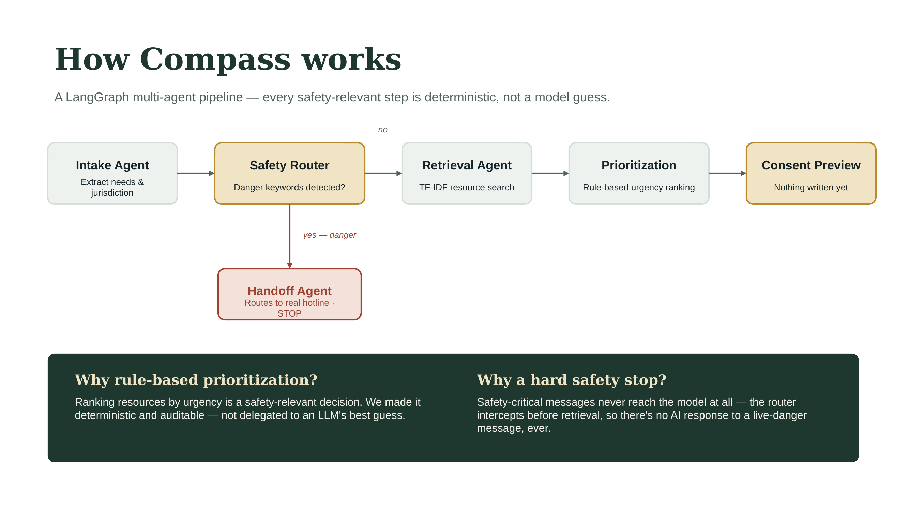

# Compass

**Resource navigation that asks before it remembers.**

Built for the Austin AI Hub Hackathon — Assist & Amplify track.

Compass helps trafficking survivors and frontline case workers find legal, medical,
immigration, and shelter resources — without storing anything about the user unless
they explicitly say so.

**Live demo:** [compass-n0vclx0uu-compass12.vercel.app/](https://compass-n0vclx0uu-compass12.vercel.app/)
**Backend API:** [compass-niz7.onrender.com](https://compass-niz7.onrender.com) 

## Why this design

Most support tools either over-collect data or make decisions that should stay with a
human. Compass is built so that:

- **Nothing persists by default.** Every `/navigate` call is stateless from a storage
  perspective — it returns resources and a *preview* of what could be saved, but writes
  nothing.
- **Saving is a separate, explicit action.** Only `POST /consent/save` writes to the
  consent ledger, and only because the user clicked "Save to my logbook."
- **Prioritization is rule-based, not model-based.** Ranking resources by urgency is a
  safety-relevant decision — it should be deterministic and auditable, not a language
  model's best guess.
- **Safety-critical messages never reach retrieval or storage.** The Safety Router in
  the LangGraph pipeline intercepts anything indicating immediate danger and routes
  straight to a real hotline, before any other agent runs.

## Architecture



```
frontend/  React + Vite app. IntakeForm -> ResourceCard list -> ConsentLedger ("logbook")
backend/
  main.py           FastAPI routes
  agents.py         LangGraph pipeline: intake -> safety router -> retrieval ->
                     prioritization -> consent preview  (or -> handoff, and stop)
  rag.py            TF-IDF (scikit-learn) retrieval over the resource KB — chosen over
                     a neural embedding model to stay within free-tier hosting memory
                     limits (512MB on Render)
  consent_ledger.py Explicit, auditable consent store (in-memory for the demo)
  data/resources.json  Seed knowledge base — 16 verified public hotline/legal-aid/
                     shelter resources across CA, WA, MI, NY, and national programs
  Dockerfile        Backup deployment target (Hugging Face Spaces), used only if
                     Render capacity becomes an issue
```

## Deployment

- **Backend:** Render (free tier), auto-deploys from `main` via `render.yaml`. Env vars
  (`GROQ_API_KEY`, `GROQ_MODEL`) are set in the Render dashboard, never committed.
- **Frontend:** Vercel, root directory `frontend`, auto-deploys from `main`. Set
  `VITE_API_BASE` to the Render backend URL in Vercel's environment variables.
- **Fallback:** if Render's memory limits become an issue again, `backend/Dockerfile`
  is ready for Hugging Face Spaces (16GB free tier) as an alternative host.

## Running locally

### Backend

```bash
cd backend
python3 -m venv venv
source venv/bin/activate        # Windows: venv\Scripts\activate
pip install -r requirements.txt
cp .env.example .env            # then add your free Groq API key
uvicorn main:app --reload --port 8000
```

Get a free Groq API key at https://console.groq.com/keys — Llama 3.3 on Groq's free
tier is plenty for the demo. If you skip the key entirely, the intake agent falls back
to simple keyword extraction so the pipeline still runs end-to-end.

### Frontend

```bash
cd frontend
npm install
npm run dev
```

Visit http://localhost:5173. The Vite dev server proxies `/api/*` to the FastAPI
backend on port 8000. For local dev against a deployed backend instead, set
`VITE_API_BASE` in `frontend/.env`.

## Demo script (for your ≤3 minute video)

1. Type a situation into the intake box (e.g. "I need help finding a safe place to stay
   and I'm not sure about my immigration status") → show ranked resources appear.
2. Click "Save to my logbook" on one resource → show it appear in the logbook sidebar
   with a visible timestamp and expiry.
3. Click "Remove" on that entry → show it disappear immediately.
4. Type something indicating immediate danger (e.g. "he's here right now, I can't
   leave") → show the Handoff Agent intercept it and display the hotline banner
   instead of resources.
5. Briefly show `agents.py` to narrate the graph: intake → safety router → (retrieval →
   prioritization → consent preview) OR (handoff, full stop).

## Data sourcing & verification

The 16 resources in `data/resources.json` were hand-selected from official sources —
the National Human Trafficking Hotline, HHS OTIP, USCIS, Polaris Project, the Institute
for Survivor Care's landscape map, and individual state/regional organizations (CAST in
CA, WARN in WA, Hope Against Trafficking in MI, NYS OTDA). No data was scraped from
unverified listings. Where a phone number wasn't publicly published for an organization,
the entry says "see website" rather than guessing.

This is a demonstration-scale knowledge base, not a production-ready directory. A real
deployment would need every entry independently re-verified with the organization
before going live, and broader state-by-state coverage — that verification workflow is
part of the roadmap, not yet built.

## Ethics / guideline compliance notes

- No facial recognition, biometric data, or re-identification of any kind — the
  knowledge base is text-only, public resource data (hotlines, legal aid directories,
  federal program pages), not scraped survivor or victim data.
- Model provider: Groq (Llama 3.3). Disclosed here and should be restated in your
  submission's "AI model use" section.
- No content in this project is AI-generated media depicting real people or events, so
  no labelling requirement applies beyond this disclosure.

## Team

Sapna Baniya & Nista Sunuwar